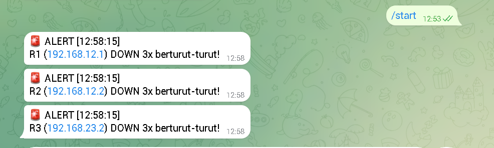

# NetSec Automation Toolkit ⚡


Toolkit otomasi jaringan dan keamanan menggunakan Ansible dan Python. Fitur utama: auto-backup konfigurasi router Cisco via Ansible dan deteksi anomali traffic dengan alert Telegram.

---

## Fitur

- 🔄 **Auto-backup** konfigurasi router Cisco via Ansible
- 🚨 **Anomaly detection** — alert Telegram jika device DOWN 3x berturut-turut
- ✅ **Recovery alert** — notifikasi otomatis saat device kembali UP
- 🕐 **Monitoring real-time** setiap 30 detik

---

## Struktur Project

```
netsec-automation-toolkit/
├── ansible/
│   ├── inventory.ini          ← daftar device yang dikelola
│   └── backup-config.yml      ← playbook backup konfigurasi router
├── python/
│   └── anomaly-detect.py      ← script deteksi anomali + Telegram alert
├── backups/                   ← hasil backup config router (auto-generated)
├── screenshots/
│   └── telegram-alert.png
└── README.md
```

---

## Cara Pakai

### Requirements

```bash
# Di Ubuntu/WSL
sudo apt install ansible -y
pip3 install requests
```

### 1. Clone repo

```bash
git clone git@github.com:zkizen/netsec-automation-toolkit.git
cd netsec-automation-toolkit
```

### 2. Setup inventory Ansible

Edit `ansible/inventory.ini` sesuai IP device lo:

```ini
[routers]
R1 ansible_host=192.168.12.1
R2 ansible_host=192.168.12.2
R3 ansible_host=192.168.23.2

[routers:vars]
ansible_user=cisco
ansible_password=cisco
ansible_connection=network_cli
ansible_network_os=ios
```

### 3. Jalankan backup config router

```bash
ansible-playbook ansible/backup-config.yml -i ansible/inventory.ini
```

Hasil backup tersimpan otomatis di folder `backups/`.

### 4. Setup Telegram Bot

- Buka Telegram → cari **@BotFather** → `/newbot`
- Copy token, lalu isi di `python/anomaly-detect.py`:

```python
TELEGRAM_TOKEN = "token_bot_lo"
TELEGRAM_CHAT_ID = "chat_id_lo"
```

### 5. Jalankan anomaly detector

```bash
python3 python/anomaly-detect.py
```

---

## Demo

### Anomaly Detection & Telegram Alert



---

## Cara Kerja

```
Script jalan → ping tiap device setiap 30 detik →
  jika DOWN 1-2x → catat, lanjut monitor
  jika DOWN 3x   → kirim alert Telegram 🚨
  jika UP lagi   → kirim recovery alert ✅
```

---

## Yang Dipelajari

- **Ansible** — inventory, playbook, dan koneksi ke Cisco IOS
- **Python automation** — monitoring loop, threshold logic
- **Telegram Bot API** — kirim notifikasi otomatis
- **WSL** — jalankan tools Linux di Windows
- **Network automation** — konsep config-as-code

---

## Author

**Muhammad Zaki Zein** — [@zkizen](https://github.com/zkizen)  
SMK TKJ Graduate
